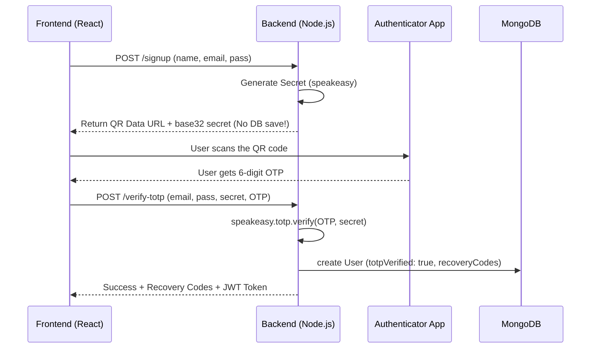

# TOTP 2FA Implementation Guide

Yeh document is project ke TOTP (Two-Factor Authentication) implementation ko detail mein explain karta hai. Isme humne complete flow, code logic, aur concepts ko "Hinglish" mein break down kiya hai taaki future developers isko easily samajh sakein.

## 1. Packages Used

Humne authentication ke liye do important NPM packages install kiye hain:

1. **`speakeasy`**: 
   - **Why:** Yeh standard TOTP (Time-Based One-Time Password) algorithm implement karta hai jo Google Authenticator ya Authy jaisi apps support karti hain. Iska kaam secret keys generate karna aur OTP codes ko verify karna hai.
2. **`qrcode`**: 
   - **Why:** `speakeasy` ek raw base32 string aur `otpauth://` URL return karta hai. `qrcode` package is URL ko ek scan-able image (Data URL) mein badal deta hai jisko hum frontend par `` karke easily display kar sakte hain.

## 2. Complete Flow & Diagram

Naya account banate waqt 2FA setup ka process kuch is tarah chalta hai:

1. **Signup Initiate**: User signup page par apni details dalta hai.
2. **Stateless Secret Gen**: Backend temporarily ek secret banata hai aur bina database mein user ko create kiye, frontend ko secret aur QR code wapis bhej deta hai.
3. **QR Scan**: User apne phone mein authenticator app kholkar QR code scan karta hai.
4. **OTP Enter**: App ek 6-digit code dikhati hai, jo user frontend mein enter karta hai.
5. **Backend Verification**: Backend us code ko verify karta hai. Agar code sahi hai, toh **finally** user ka document MongoDB mein create hota hai aur backup ke liye recovery codes generate hote hain.
6. **Next Login**: Agli baar jab user email/pass dalega, toh backend ek flag `require2FA: true` bhejega jisse frontend 6-digit OTP ki maang karega.



## 3. Core Concepts (Zaroori Concepts)

- **TOTP**: Time-Based One-Time Password. Har 30 seconds mein ek naya code banta hai. Yeh code current time aur secret key ka mathmatical combination hota hai.
- **Secret & Base32**: Ek unique random key (jaise `JBSWY3DPEHPK3PXP`) jo server aur phone ke paas hoti hai. `Base32` format isliye use karte hain kyunki yeh URL safe hota hai.
- **QR / otpauth://**: Yeh ek standard URL format hai: `otpauth://totp/AppName?secret=XYZ`. Sabhi authenticator apps is standard ko samajhti hain.
- **Time Window**: Server aur phone ka time bilkul same hona chahiye. Par thodi bohot de-sync (time drift) common hai. Isliye hum `window: 2` set karte hain taaki aage-peeche ke time periods bhi accept ho jayein (Tolerance).
- **Recovery Codes**: Agar phone kho jaye ya app uninstall ho jaye, toh inn static 10-character codes ka use karke login kiya jaa sakta hai. Har code sirf ek hi baar chalta hai.
- **Why No Gmail/SMS is Needed?**: TOTP offline chalta hai! Kyunki dono taraf (Server aur Phone) ko formula aur secret pata hai, toh bas apne ghadi (clock) ka time dekh kar dono same OTP calculate kar sakte hain.

## 4. Code Walkthrough

Yahan hum dekhenge ki files ke andar main logic kya kar raha hai.

### Database Schema (`backend/models/User.js`)
Humne User mongoose schema mein 3 important fields add kiye hain:
```javascript
  totpSecret: { type: String }, // User ka Base32 secret store karta hai
  totpVerified: { type: Boolean, default: false }, // Boolean flag ki 2FA active hai ya nahi
  recoveryCodes: [{ type: String }], // Single-use static codes ka array
```

### Signup API (`backend/controllers/authController.js`)
Signup par hum user ko DB mein save **nahi** karte. Isse incomplete/abandoned registrations se hamara database garbage nahi banta.
```javascript
// App name mein ek random suffix add kiya hai taaki ek hi email se baar-baar 
// test karne pe authenticator app mein entries mix na ho jayein.
const randomSuffix = Math.floor(1000 + Math.random() * 9000);
const secret = speakeasy.generateSecret({ name: `ShopX (${email}) #${randomSuffix}` });

const qrCodeDataUrl = await qrcode.toDataURL(secret.otpauth_url);

// Front-end ko secret return karte hain (taaki aagle verify step mein kaam aaye)
res.status(200).json({
    data: { totpSetup: { qrCodeDataUrl, secret: secret.base32 } }
});
```

### Verify TOTP API (`backend/controllers/authController.js`)
Yeh actual account creation endpoint hai. Yahan auth/validation hota hai, tabhi user DB mein entry paata hai.
```javascript
// Spaces remove kar diye taaki agar user "123 456" copy-paste kare toh verify fail na ho
const sanitizedToken = String(token).replace(/\s+/g, '');

const verified = speakeasy.totp.verify({
    secret, // signup se pass hua temporary secret
    encoding: 'base32',
    token: sanitizedToken,
    window: 2, // +/- 1 minute time drift allow karta hai
});

if (!verified) return res.status(400).json({ message: 'Invalid TOTP code' });

// Jab verification pass ho gaya, tab jaa kar MongoDB record create hota hai
const user = await User.create({ name, email, password, totpSecret: secret, totpVerified: true, recoveryCodes });
```

### Login API (`backend/controllers/authController.js`)
Login method dono handle karta hai: Password and OTP/Recovery code.
```javascript
if (user.totpSecret) {
    if (!totpCode) {
        // Agar OTP nahi bheja, toh frontend ko bata do ki form switch kare
        return res.json({ success: true, require2FA: true, message: '2FA code required' });
    }
    
    // OTP verify karo ya phir check karo ki user ne kahin backup/recovery code toh nahi daala
    if (!verified) {
        if (user.recoveryCodes.includes(sanitizedToken)) {
            // Backup code use kar liya, ab usko DB se hata do (Single-use)
            user.recoveryCodes = user.recoveryCodes.filter(c => c !== sanitizedToken);
            await user.save();
        } else {
            return res.status(400).json({ message: 'Invalid 2FA code' });
        }
    }
}
```

## 5. Dry Run (Real-World Data Example)

Chalo Rahul naam ke user ka step-by-step example dekhte hain:

1. **Signup Form**: Rahul apna name, `rahul@gmail.com`, aur password type karke submit karta hai.
2. **Secret Generation**: Backend check karta hai ki user exists nahi karta. Woh `speakeasy` use karke secret banata hai (e.g. `JBSWY3DPEHPK3PXP`) aur QR code bhejta hai. Data abhi frontend ke memory state (`tempSecret`) mein rakha jata hai.
3. **Authenticator App**: Rahul QR scan karta hai. App mein `ShopX (rahul@gmail.com) #5192` add ho jata hai aur screen pe `146 393` aata hai.
4. **Verification**: Rahul code type karke submit karta hai. Frontend `/verify-totp` ko payload bhejta hai: `{ email: "rahul@gmail.com", secret: "JBSWY...", token: "146393" }`.
5. **Backend Processing**: 
   - Backend `JBSWY...` secret aur server ki current clock ka use karke expected OTP calculate karta hai.
   - Agar expected OTP aur `146393` match ho gaye, toh backend 10 random alphanumeric recovery codes banata hai.
   - MongoDB mein naya User record insert ho jata hai `totpVerified = true` ke saath.
6. **Login**: Rahul jab wapis aayega, tab woh apna password dalega. Backend check karega `totpVerified == true`, aur usko bolega 2FA code daalo. Rahul code daalega and then use final JWT token mil jayega.

## 6. Security, Errors & Edge Cases

Humne is flow ko kaafi secure aur foolproof banaya hai. Kuch common issues jo handle kiye gaye:

- **Invalid OTP Bug (401 Interceptor Loop)**: Pehle backend jab wrong OTP par `401 Unauthorized` return karta tha, tab global Axios interceptor (frontend/lib/api.ts) us 401 ko pakad kar explicitly page ko `/login` pe redirect kar deta tha. Isse user screen se hi bahar fek diya jata tha! Fix karne ke liye, backend se Invalid OTP ka response `400 Bad Request` kar diya gaya hai, taaki interceptor ignore kare aur frontend bas clearly error show karein bina page badle.
- **Old Authenticator Entries (Duplicate Name issue)**: Development ya multiple failures ke time user same email se bohot baar QR code scan karta hai, jisse uski app me purane codes bhare jate the. Ab humne `name` mein `#random4digits` lagaya hai taaki user uniquely pehchaan sake ki kis entry ka code check karna hai.
- **Clock Desync**: TOTP solely time-based hai. Agar user ke phone ka time 2 minutes bhi galat hai, toh OTP kabhi verify nahi hoga. Isiliye `.verify()` ke andar `window: 2` dala gaya hai. Iska matlab hai ki code current 30 second step se 1 minute aage ya peeche ka bhi tolerate ho jayega.
- **Unverified Users (Stateless Signup)**: Agar database mein `User.create` turant kar diya jaye, toh agar user beech mein OTP window band karde, DB mein adha kachra (unverified account) fans jayega aur woh us email se kabhi account nahi bana payega. Islye implementation mein "Stateless" pattern follow kiya gaya hai: **Verification pass hone par hi record banta hai.**
